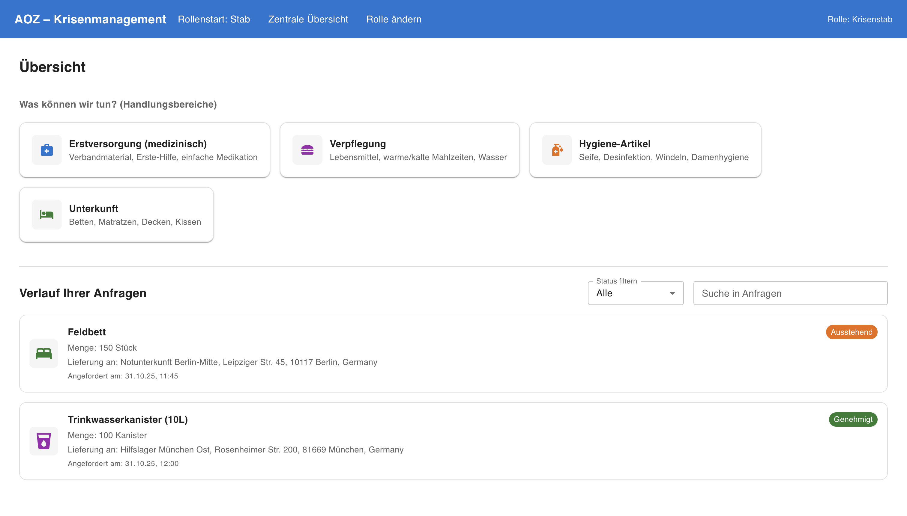
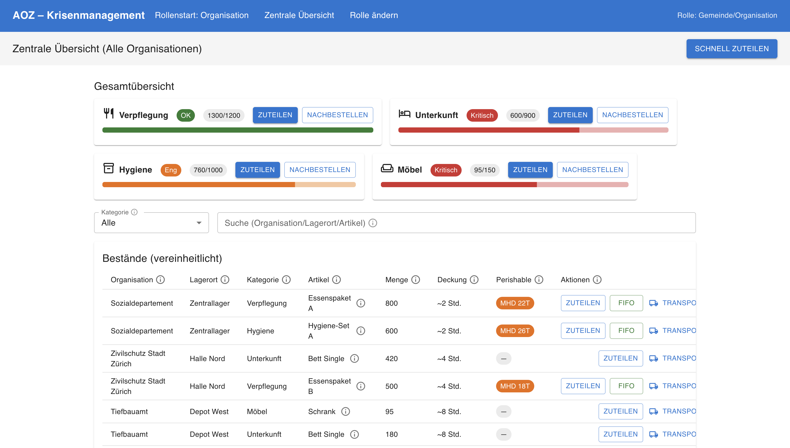
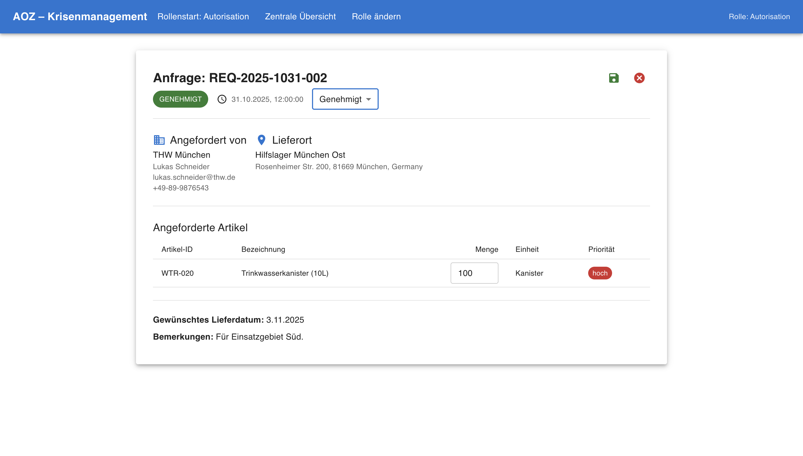
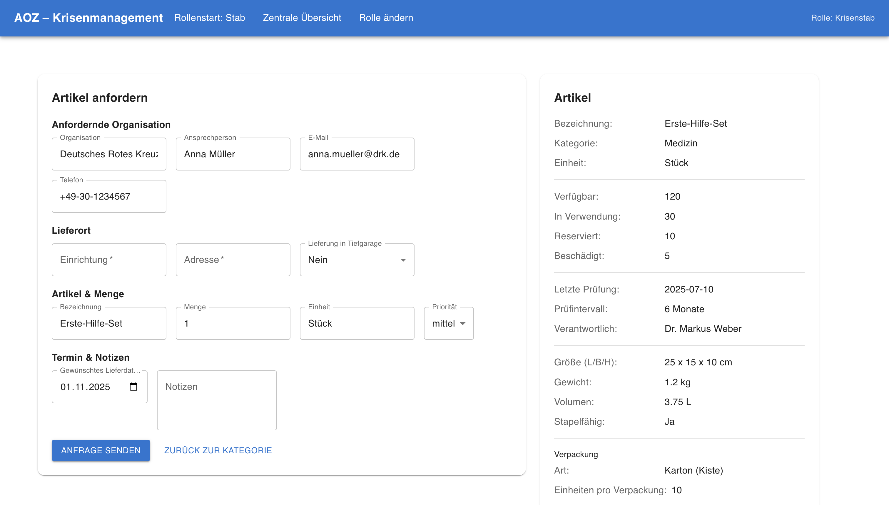
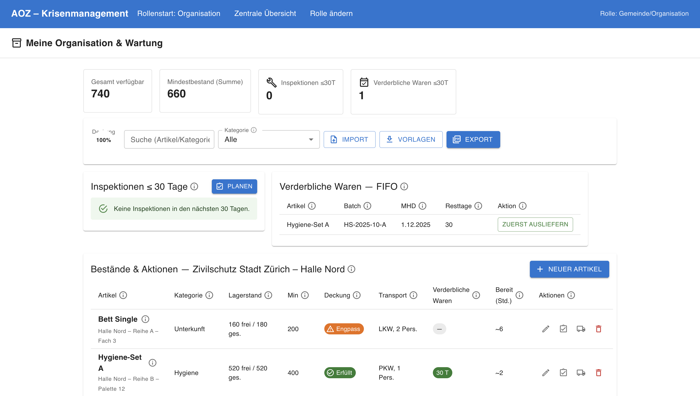
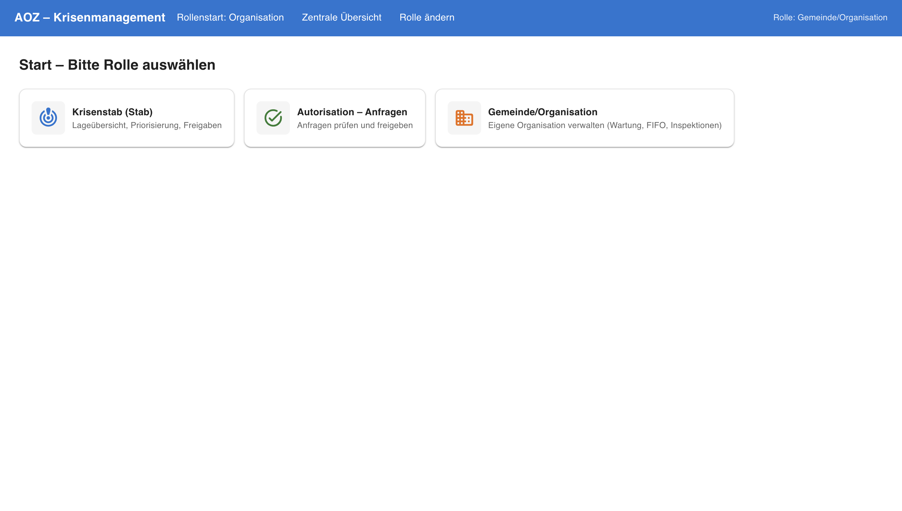

# 🏗️ SupplyHub

**SupplyHub** is a centralized crisis management platform designed to streamline the **distribution of goods and resources** during emergencies and humanitarian crises.
Built at a UZH seminars hackathon, SupplyHub connects **crisis management team (Kriesenstab)** with other **government agencies** to ensure that help reaches where it’s needed most — efficiently and transparently.

---

## 🌍 Problem Statement

During crises such as natural disasters, pandemics, or conflicts, **supply chain coordination** often breaks down.
Relief organizations struggle with:

- Lack of visibility into **available resources** and **current needs**
- **Inefficient communication** between multiple stakeholders
- **Duplicate efforts** and **delayed aid delivery**

**SupplyHub** addresses these issues by providing a unified, data-driven platform for real-time coordination.

---

---

## 🚀 Features

- **🗺️ Centralized Dashboard:** Visualize supply and demand in real time.
- **🤝 Request Ticket System:** Approve requests made by crisis management as the authorization entity.
- **📦 Inventory Tracking:** Manage stock levels and monitor incoming/outgoing shipments.
- **🌐 Multi-role Access:** Separate dashboards for crisis management team, logistics teams, and administrators.

---

## Screenshots

## 🧠 Tech Stack

| Category      | Technology |
| ------------- | ---------- |
| **Prototype** | React.js   |

## AI Usage during the development phase

The group used AI to generate both the HTML elements and the underlying data structures required for display. An exemplary workflow for creating a single React component with AI proceeded as follows:

1. They prompted an LLM to propose a JSON data structure for the specific use case.

2. They refined the generated data structure through iterative prompting.

3. They requested the LLM to generate React components using the MUI library to render the data.

4. They visualized the generated code in the local environment and further refined it in collaboration with the LLM.

5. They manually integrated the finalized component into the existing project scaffold.

This workflow was repeated multiple times for most of the different components.

The final integration and validation of the single components remained manual to ensure architectural coherence and reliability.

## Team members

Daniel Maksimovic, Katerina Kuneva, Nils Grob

Effort and responsibility during the hackathon were divided equally among all team members.
The same goes for the written report.

## Demo video

The demo video can be found on [Sharepoint](https://uzh.sharepoint.com/:v:/r/sites/SeminarDigitalPlatformsforResilience/Shared%20Documents/General/Recordings/View%20Only/Besprechung%20in%20Allgemein-20251213_161106-Meeting%20Recording.mp4?csf=1&web=1&e=XEvlgN)
